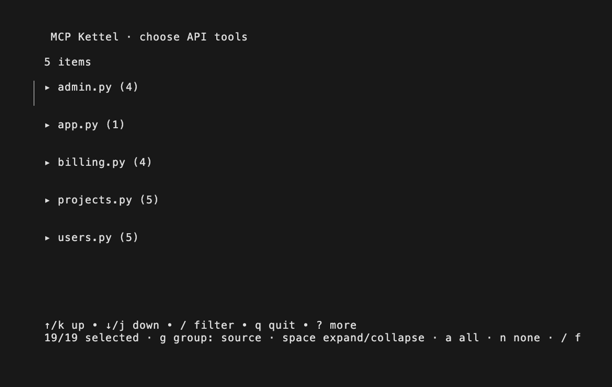
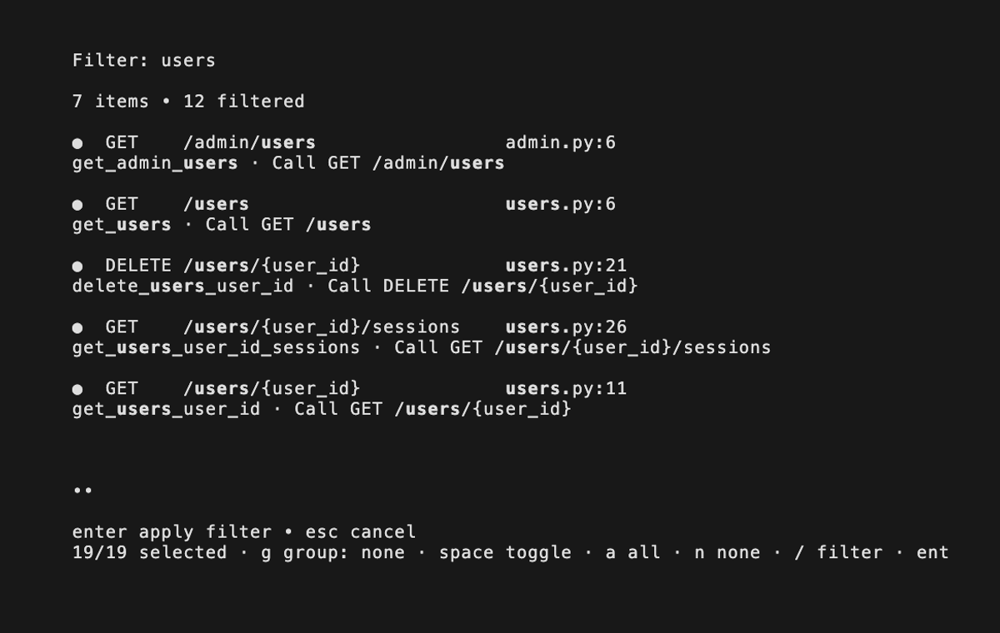

# MCP Kettel

> *Turn useful routes in a local API project into an MCP server.*

[](./LICENSE)
[](./go.mod)
[](https://go.dev/)


## What's in it for you

- Find FastAPI or Express routes without running or importing the source project.
- Review discovered routes before exposing anything.
- Search, select, or clear routes from an interactive terminal checklist.
- Generate a standalone Go MCP server with only the routes you chose.
- Keep credentials out of generated source.

## Features

- Static FastAPI route discovery.
- Recursive FastAPI router and prefix resolution.
- Static Express route discovery for JavaScript and TypeScript projects.
- Support for `GET`, `POST`, `PUT`, `PATCH`, `DELETE`, `OPTIONS`, and `HEAD`.
- Primitive path and query parameters: `str`, `int`, `float`, and `bool`.
- Deterministic MCP server generation.
- Optional upstream `Authorization` header forwarding.
- Safe cancellation and refusal to overwrite an existing output directory.

## Quick Start

Install Go 1.24 or newer, then run Kettel against a FastAPI or Express project:

```sh
go run ./cmd/mcp-kettel \
  --input /path/to/fastapi-project \
  --output ./generated-mcp
```

Try the included example:

```sh
go run ./cmd/mcp-kettel \
  --input ./example/sample-project \
  --output ./generated-mcp
```

Try the Express fixture:

```sh
go run ./cmd/mcp-kettel \
  --input ./example/express-project \
  --output ./generated-express-mcp
```

The checklist starts with every route selected. Use `g` to cycle grouping by source file, HTTP method, or route prefix. Groups start collapsed; highlight a group and press `space` to expand or collapse it. Once expanded, use `space` on a route to toggle one, `a` to select all, `n` to clear all, `/` to filter, `enter` to generate, or `esc` to cancel.

| Group large route sets | Filter matching APIs |
| --- | --- |
|  |  |

Run the generated server beside the running FastAPI application:

```sh
cd generated-mcp
MCP_API_BASE_URL=http://127.0.0.1:8000 go run .
```

For an authenticated API, set the complete header value:

```sh
MCP_API_AUTHORIZATION="Bearer $TOKEN" \
MCP_API_BASE_URL=http://127.0.0.1:8000 \
go run .
```

If `--output` is omitted, Kettel writes to `<input>/mcp-server`.

FastAPI routes support primitive path and query parameters. Express routes support literal `app.get(...)`, `router.post(...)`, and related method calls with literal paths and path parameters such as `/users/:id`.

## Documentation

- [Architecture and data flow](./docs/architecture.md)
- [Contributing](./docs/contributing.md)

## License

Unlicensed (no terms declared). See [LICENSE](./LICENSE).
